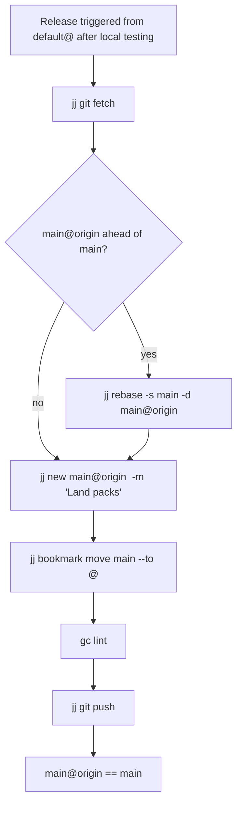

# Release Workflow

This diagram shows how tested pack work moves from local `main` to GitHub.

## Release steps

## Notes

- Always fetch first. `main@origin` is the live target.
- If origin has moved, rebase local `main` onto `main@origin` before landing.
- If multiple pack lines land together, create one merge commit whose parents
  include `main@origin` and every pack tip.
- After moving `main`, verify the landed packs still lint cleanly.
- Push only after verification.
- Do not push `gc/*` workspace bookmarks to origin; they are local-only.
