# Packer Workflow Overview

Packer uses three workflows that must not be confused: **packsmith work**,
**local integration testing**, and **release to GitHub**.

## Workspace and bookmark semantics

| Symbol | Meaning |
| --- | --- |
| `default@` | Working copy of the rig-root default workspace. New pack workspaces are created from this commit. Used for local integration testing. |
| `main` | Local integration bookmark in `gascity-packs`. |
| `main@` | Commit that the local `main` bookmark points to. Packsmiths rebase onto this. |
| `main@origin` | `main` bookmark on the `origin` remote. This is the live published state. |
| `gc/<pack>` | Live workspace bookmark for a pack workspace. Tracks `@`, not landed state. |

## The three workflows

```mermaid
flowchart LR
  subgraph packsmith["1. Packsmith work"]
    claim["claim bead"]
    edit["edit pack files"]
    change["run mol-jj-change per logical change"]
    complete["run mol-packer-complete"]
    move_main["move main to landed tip"]

    claim --> edit --> change --> complete --> move_main
  end

  subgraph test["2. Local integration test"]
    default["default@ workspace"]
    edit_default["jj edit &lt;integrated-head&gt;"]
    lint["gc lint <pack>"]

    move_main --> default --> edit_default --> lint
  end

  subgraph release["3. Release to GitHub"]
    fetch["jj git fetch"]
    sync["rebase main onto main@origin if needed"]
    push["jj git push"]

    lint --> fetch --> sync --> push
  end
```



## 1. Packsmith work

Packsmiths work in sparse jj workspaces scoped to one pack. Their integration
target is the local `main@` bookmark.

- Each logical change goes through `mol-jj-change`.
- When the bead is complete, `mol-packer-complete` rebases the pack line onto
  `main@`, moves the local `main` bookmark to the tip, verifies, and leaves a
  clean working copy.

This keeps pack work staged on local `main`, ready for testing.

## 2. Local integration test

After packsmiths land work on `main`, move the rig-root `default@` workspace to
the integrated head so the combined local state can be tested or inspected.

```bash
jj edit <integrated-head>
gc lint <pack>
```

`default@` is not the release target. It is the local integration sandbox.

## 3. Release to GitHub

Only the release workflow pushes to `origin`. Before pushing, ensure local
`main` is on top of the latest published state:

```bash
jj git fetch
jj log -r 'main | main@origin' --no-graph

# If main@origin has moved ahead, rebase local main onto it first
jj rebase -s main -d main@origin
jj git push
```

If multiple pack lines must release together, use `mol-packer-land` from the rig
root to merge them onto `main@origin`, move `main`, and push.

## Key rule

Packsmiths target `main@`. The release workflow targets `main@origin`. Never
confuse local integration (`default@`) with either of them.
